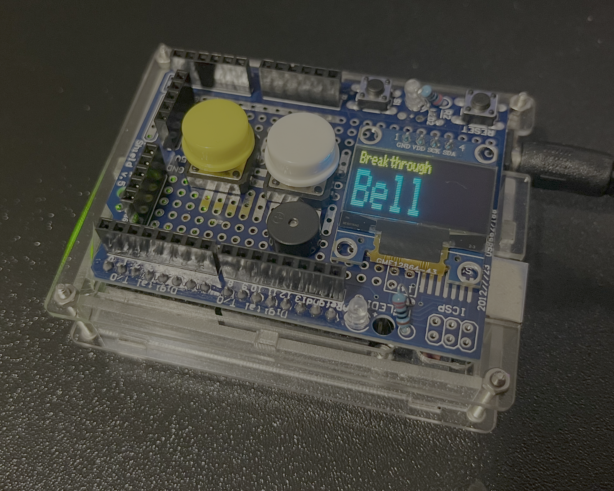
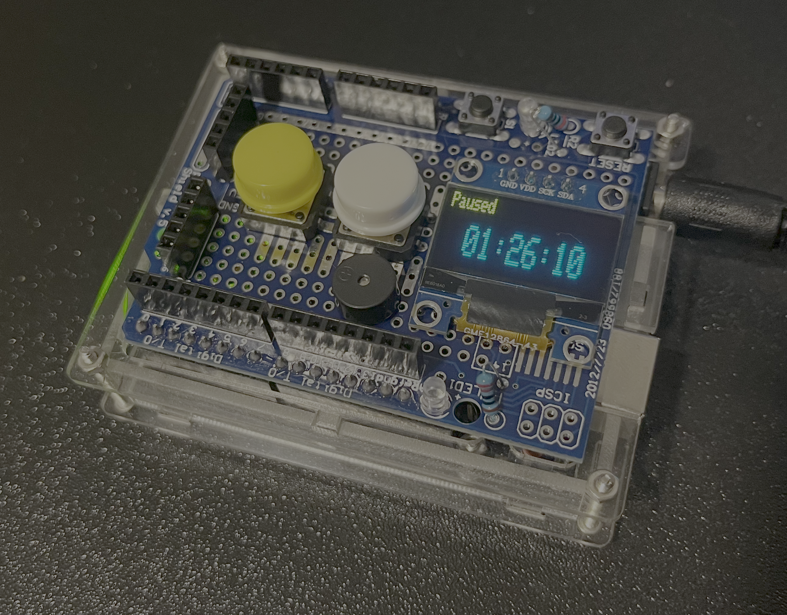
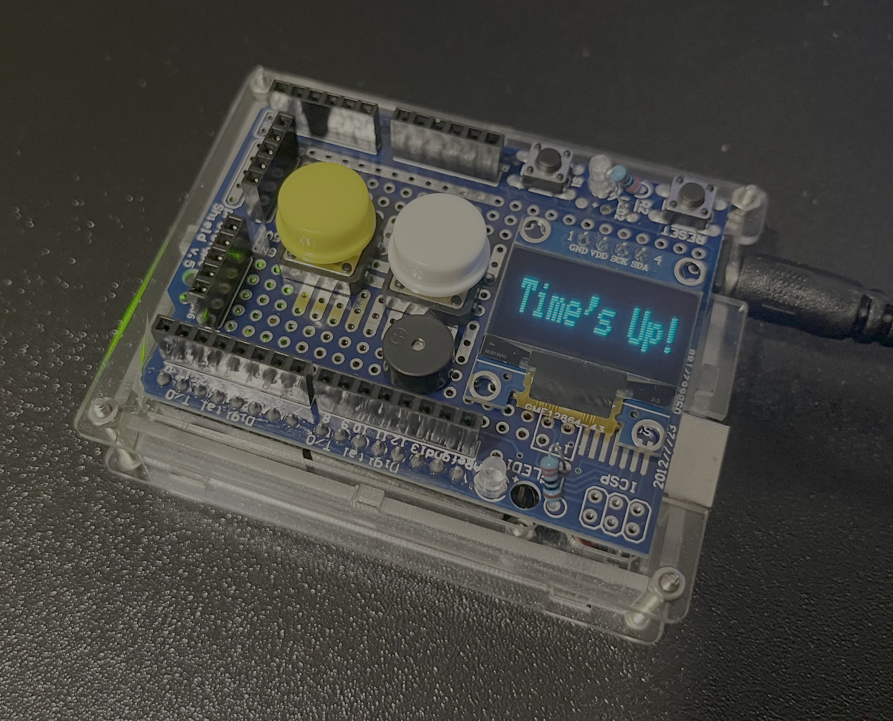

# Breakthrough Bell ⏰
**An Arduino timer signaling the start and end of focused work, and the cue for a refreshing break.**

It seems like a very particular description for a simple timer, doesn't it?... The reason is that I created this timer to control daily work cycles, with the goal of working for 20 or 30 minute periods and taking regular breaks.

If you take regular active breaks at work, you can:
- 👀 **Reduces Eye Strain and Digital Fatigue**: Stepping away from the screen allows your eyes to rest, reducing dryness, blurriness, and headaches associated with prolonged computer use.
- 💪🏻 **Prevents Musculoskeletal Issues**: Regular movement and stretching break up long periods of sitting, which can alleviate and prevent back pain, neck stiffness, and carpal tunnel syndrome by improving circulation and posture.
- 💡 **Boosts Mental Clarity and Focus**: Short breaks help to reset your mind, reducing mental fatigue and preventing burnout. This can lead to improved concentration and problem-solving skills when you return to your tasks.
- 🤪 **Lowers Stress Levels**: Disconnecting from work, even for a few minutes, allows you to de-stress and recharge. This can lead to a decrease in anxiety and an overall improvement in mood.
- 🔋 **Enhances Physical Health and Energy Levels**: Active pauses, like a quick walk or some stretches, can increase blood flow, oxygenation, and energy, counteracting the sedentary nature of remote work and contributing to better cardiovascular health.

This is my way of enjoying technology and programming, developing small things that generate real value! 👨🏻‍💻💙

## Components

The timer was built using the following components:

- 🧠 **Arduino UNO R3**: The Arduino UNO R3 is the brain of the timer. It is responsible for running the source code and controlling the peripherals.
- 🔌 **Prototype Shield v.5 for Arduino**: The shield is used to connect the peripherals to the Arduino UNO R3 in a practical way.
- 🖥️ **Display OLED I2C**: The display is used to show the time remaining and the configuration stages to facilitate its use for the user.
- 🔉 **Active Buzzer**: It is used to signal that time is up.
- 🔘 **Push Buttons**: The timer has 4 buttons:
  - ⏯️ **Start/Stop**: It is used to start and stop the timer when it is pushed for short time. When it is pushed for a long time, it is used to move to the configuration mode. This button comes integrated with the prototype shield.
  - 🔄 **Reset**: It is used to reset the timer. This button comes integrated with the prototype shield.
  - 🔼 **Up**: It is used to increase the time of the timer in specific configuration stage.
  - 🔽 **Down**: It is used to decrease the time of the timer in specific configuration stage.

  
  
<em>Breakthrough Bell Prototype. Photo taken by <a href="https://github.com/JMTamayo">@JMTamayo</a></em>.

## How it works

Refer to the [config](src/config/conf.h) module file to take a look at the configuration of the timer, the pins used, and the default values.

1. When the timer is started, it will show the **main screen** with the name of the project.

  
  
<em>Main Screen. Photo taken by <a href="https://github.com/JMTamayo">@JMTamayo</a></em>.

2. Few seconds after the timer is started, it will show the **pause screen**. At this point, the user can press the **start/stop** button to start the timer. From the **running screen**, the user can press the **start/stop** button to pause the timer.

  
  
<em>Pause Screen. Photo taken by <a href="https://github.com/JMTamayo">@JMTamayo</a></em>.

3. If the user holds the **start/stop** button from **paused screen**, it will show the **seconds configuration screen**. At this point, the user can use the **up** and **down** buttons to change the number of seconds of the timer.

  
  
<em>Config Seconds Screen. Photo taken by <a href="https://github.com/JMTamayo">@JMTamayo</a></em>.

4. To go to the next configuration stage, the user can press the **start/stop** button again. This will show the **minutes configuration screen** and then the **hours configuration screen**.

5. When the user is satisfied with the configuration, he/she can hold the **start/stop** button to go to the **pause screen** again.

6. When the timer is finished, a time's up message will be shown and the buzzer will sound.

  
  
<em>Time's Up Screen. Photo taken by <a href="https://github.com/JMTamayo">@JMTamayo</a></em>.

## About the Project

- The source code is written in [C++](https://en.wikipedia.org/wiki/C%2B%2B) using [PlatformIO](https://platformio.org/) with [Cursor](https://www.cursor.com/) as the IDE.
- This is my first project using C++ for embedded systems, so I'm sure there are many things to improve. Let me know if you have any suggestions!

## License

This project is licensed under the [MIT License](LICENSE).